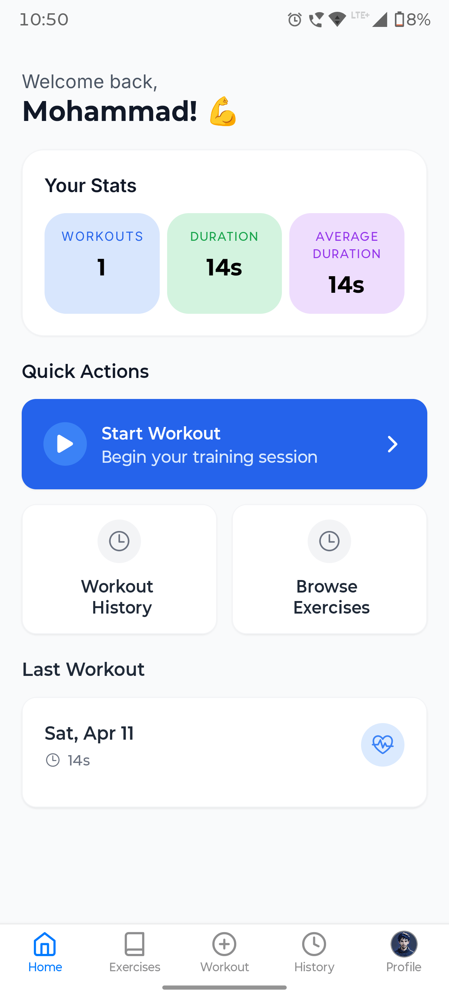
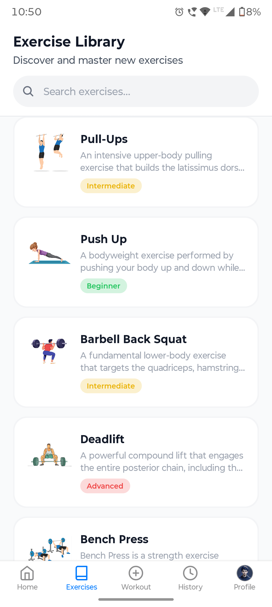
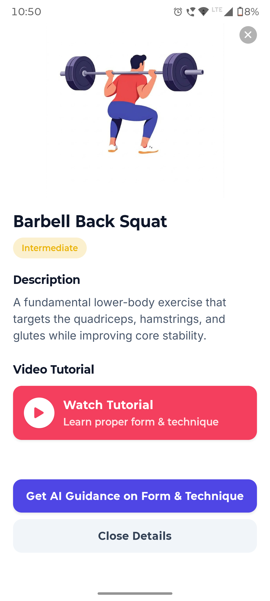
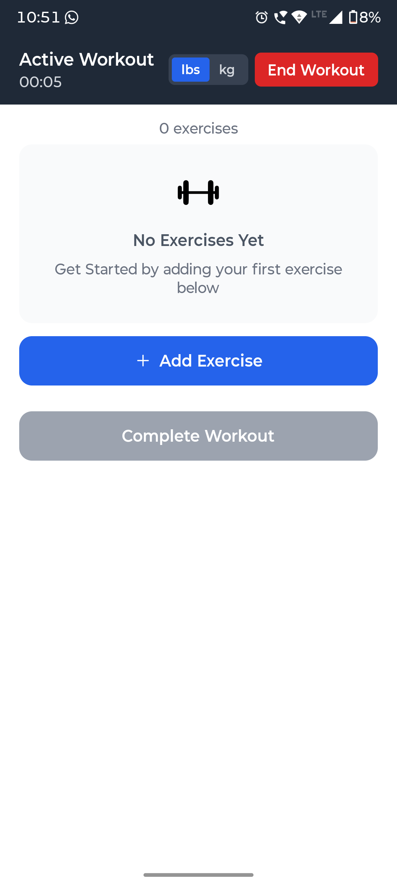
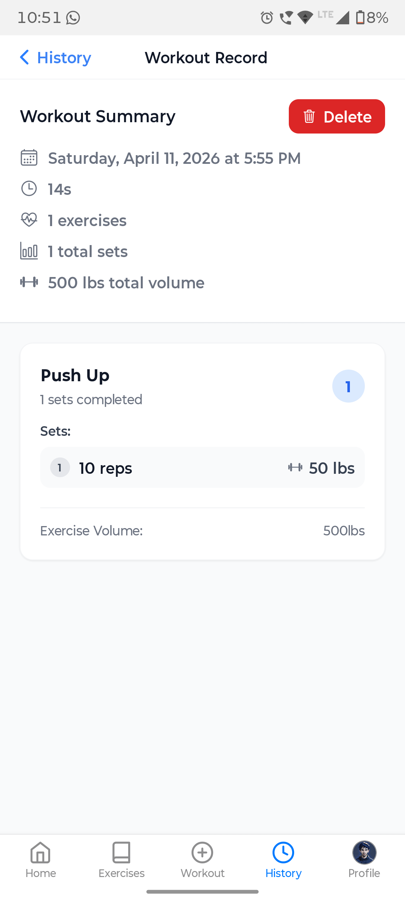
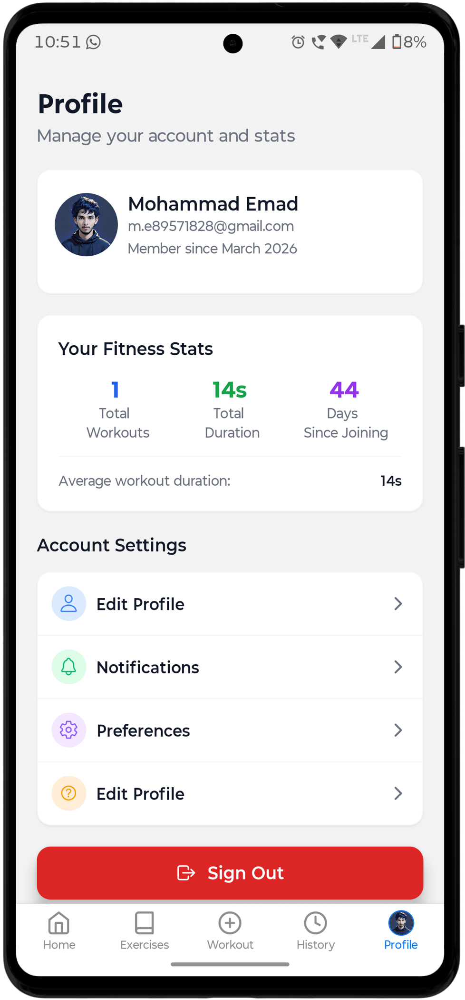

# FitNova - Professional Workout Tracker 🏋️‍♂️

FitNova is a premium, feature-rich workout tracking application built with **React Native** and **Expo**. It empowers users to plan, track, and analyze their fitness journey with a sleek, modern interface.

[](https://expo.dev/)
[](https://reactnative.dev/)
[](https://tailwindcss.com/)
[](https://clerk.com/)
[](https://www.sanity.io/)

---

## 📱 App Screenshots

| Home Dashboard | Exercise Library | Exercise Details |
| :-: | :-: | :-: |
|  |  |  |

| Plan Workout | Active Tracking | User Profile |
| :-: | :-: | :-: |
|  |  |  |

---

## ✨ Key Features

- **🏠 Comprehensive Dashboard**: Stay on top of your fitness goals with a dynamic home screen showing your latest progress and upcoming workouts.
- **📚 Extensive Exercise Library**: Browse a vast collection of exercises with detailed instructions and high-quality images powered by Sanity CMS.
- **⏱️ Real-time Workout Tracking**: Log your sets, reps, and weights in real-time with an intuitive active workout interface.
- **📅 Workout Planning**: Schedule and plan your workout routines ahead of time to stay consistent.
- **📈 Progress History**: Review your past workouts and track your performance trends over time.
- **🔐 Secure Authentication**: Seamless and secure login/sign-up experience powered by Clerk.
- **🎨 Premium UI/UX**: Beautifully designed with NativeWind (Tailwind CSS) for a modern, responsive feel.

---

## 🛠️ Tech Stack

- **Frontend**: React Native, Expo, Expo Router
- **Styling**: NativeWind (Tailwind CSS)
- **State Management**: Zustand
- **Animations**: React Native Reanimated
- **Authentication**: Clerk
- **Backend/CMS**: Sanity.io (for exercise content)
- **Icons**: Lucide React Native (via Expo Symbols/Vector Icons)
- **Persistence**: Expo Secure Store & Async Storage

---

## 🚀 Getting Started

### Prerequisites

- [Node.js](https://nodejs.org/) (v18 or later)
- [npm](https://www.npmjs.com/) or [yarn](https://yarnpkg.com/)
- [Expo Go](https://expo.dev/go) app on your mobile device or an Emulator/Simulator

### Installation

1. **Clone the repository:**
   ```bash
   git clone https://github.com/your-username/workout-tracker.git
   cd workout-tracker
   ```

2. **Install dependencies:**
   ```bash
   npm install
   ```

3. **Set up Environment Variables:**
   Create a `.env` file in the root directory and add your Clerk and Sanity credentials:
   ```env
   EXPO_PUBLIC_CLERK_PUBLISHABLE_KEY=your_clerk_key
   EXPO_PUBLIC_SANITY_PROJECT_ID=your_sanity_id
   EXPO_PUBLIC_SANITY_DATASET=production
   ```

4. **Start the development server:**
   ```bash
   npm run start
   ```

5. **Open the app:**
   - Scan the QR code with your phone (Expo Go).
   - Press `a` for Android Emulator.
   - Press `i` for iOS Simulator.

---

## 📂 Project Structure

```text
├── app/                  # Expo Router - File-based routing
│   ├── (app)/            # Authenticated application routes
│   │   ├── (tabs)/       # Tab-based navigation (Home, Exercises, etc.)
│   │   └── _layout.tsx   # Authenticated layout
│   ├── sign-in.tsx       # Authentication screens
│   └── _layout.tsx       # Root layout
├── assets/               # Static assets (images, icons, fonts)
├── components/           # Reusable UI components
├── constants/            # Application constants and configuration
├── hooks/                # Custom React hooks
├── lib/                  # Third-party library configurations (Sanity, etc.)
├── store/                # Zustand state management
├── sanity/               # Sanity CMS configuration and schemas
└── tailwind.config.js    # Tailwind CSS configuration
```

---

## 📄 License

This project is licensed under the MIT License - see the [LICENSE](LICENSE) file for details.

---

Developed with ❤️ by [Your Name/Company]
